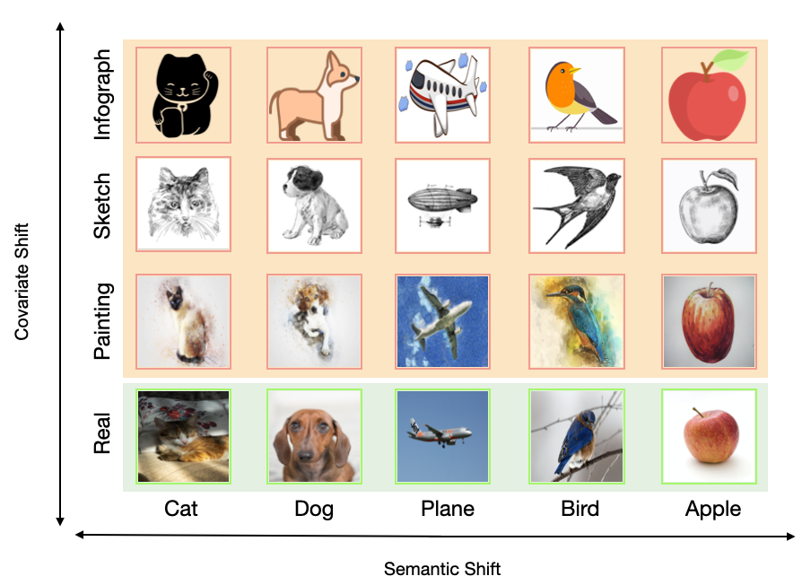

# Dissecting Out-of-Distribution Detection and Open-Set Recognition: A Critical Analysis of Methods and Benchmarks (IJCV 2024)

<p align="center">
  <a href="https://whj363636.github.io/">Hongjun Wang<sup>1</sup></a>, 
  <a href="https://sgvaze.github.io/">Sagar Vaze<sup>2</sup></a>, 
  <a href="https://www.kaihan.org/">Kai Han<sup>1</sup></a> </br>
<a href="https://visailab.github.io/index.html"><sup>1</sup>Visual AI Lab, The University of Hong Kong</a>
<a href="https://www.robots.ox.ac.uk/~vgg/"><sup>2</sup>Visual Geometry Group, University of Oxford</a>
</p>

<p align="center">
    <a href="https://arxiv.org/abs/2403.13684"></a>
    <a href="https://visual-ai.github.io/Dissect-OOD-OSR/"></a>
    <a href="#jump"></a>
</p>

> **Abstract:** *Detecting test-time distribution shift has emerged as a key capability for safely deployed machine learning models, with the question being tackled under various guises in recent years. In this paper, we aim to provide a consolidated view of the two largest sub-fields within the community: out-of-distribution (OOD) detection and open-set recognition (OSR). In particular, we aim to provide rigorous empirical analysis of different methods across settings and provide actionable takeaways for practitioners and researchers.
Concretely, we make the following contributions:
(i) We perform rigorous cross-evaluation between state-of-the-art methods in the OOD detection and OSR settings and identify a strong correlation between the performances of methods for them;
(ii) We propose a new, large-scale benchmark setting which we suggest better disentangles the problem tackled by OOD detection and OSR, re-evaluating state-of-the-art OOD detection and OSR methods in this setting; 
(iii) We surprisingly find that the best performing method on standard benchmarks (Outlier Exposure) struggles when tested at scale, while scoring rules which are sensitive to the deep feature magnitude consistently show promise;
and (iv) We conduct empirical analysis to explain these phenomena and highlight directions for future research.*



## Running

### Prerequisite 🛠️

```
pip install -r requirements.txt
```

### Datasets

A number of datasets are used for OOD and OSR cross-benchmarking:
* Standard Benchmarks: [SVHN](https://pytorch.org/vision/stable/datasets.html),
[CIFAR-10/100](https://pytorch.org/vision/stable/datasets.html),
[TinyImageNet](https://github.com/rmccorm4/Tiny-Imagenet-200), [Textures](https://www.robots.ox.ac.uk/~vgg/data/dtd/), [LSUN](http://pages.cs.wisc.edu/~huangrui/imagenet_ood_dataset/SUN.tar.gz), [LSUN-R](https://www.dropbox.com/s/moqh2wh8696c3yl/LSUN_resize.tar.gz), [iSUN](https://www.dropbox.com/s/ssz7qxfqae0cca5/iSUN.tar.gz), [Places](http://pages.cs.wisc.edu/~huangrui/imagenet_ood_dataset/Places.tar.gz), 

* Proposed SSB Benchmarks: [ImageNet-21K-P](https://github.com/Alibaba-MIIL/ImageNet21K), [ImageNet-C](https://zenodo.org/records/2235448), [ImageNet-R](https://people.eecs.berkeley.edu/~hendrycks/imagenet-r.tar),
 [CUB](http://www.vision.caltech.edu/visipedia/CUB-200.html),
 [Standford Cars](https://www.kaggle.com/datasets/jessicali9530/stanford-cars-dataset),
[FGVC-Aircraft](https://www.robots.ox.ac.uk/~vgg/data/fgvc-aircraft/)

For TinyImageNet, you also need to run `create_val_img_folder` in `data/tinyimagenet.py` to create
a directory with the test data.

**Open-set Splits**:

For the proposed open-set benchmarks, the directory ```data/open_set_splits``` contains the proposed class splits
 as ```.pkl``` files. For the FGVC datasets, the files also include information on which
 open-set classes are most similar to which closed-set classes.

### Config

For ```config.py```, please set paths to datasets and pre-trained models (for SSB experiments)

For ```train_configs.yaml```, we offer the default training configurations for different datatsets. Datasets which are not included in the list can be use either of them.


### Scripts

**Train models**: This will verify different training methods (e.g. CE, ARPL/ARPL+CS, OE or GODIN). To train models on a specified dataset, run the scirpt in the below path:

```
bash bash_scripts/new_bash/train/xxx.sh
```

Please change ```PYTHON``` (path to python interpreter) in the specific ```bash_scripts``` scripts to fit your own environment. 

**Evaluating models**: This will verify different scoring rules (e.g. MSP, MLS, Energy, ect). After you obtain the model checkpoint (no matter downloaded or trained by youself), set ```DIRS``` to the path of the model you would like to evaluate. 

To evaluate `all' the scoring rules, run the scripts in the below path:

```
bash bash_scripts/new_bash/eval/xxx.sh
```

By default, the sciprt will sweep all the scoring rules in `OOD_METHODS'.

  
## Citing this work
<span id="jump"></span>
If you find this repo useful for your research, please consider citing our paper:

```bibtex
@article{wang2024dissect,
    author    = {Wang, Hongjun and Vaze, Sagar and Han, Kai},
    title     = {Dissecting Out-of-Distribution Detection and Open-Set Recognition: A Critical Analysis of Methods and Benchmarks},
    journal = {International Journal of Computer Vision (IJCV)},
    year      = {2024}
}
```
